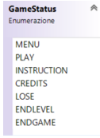
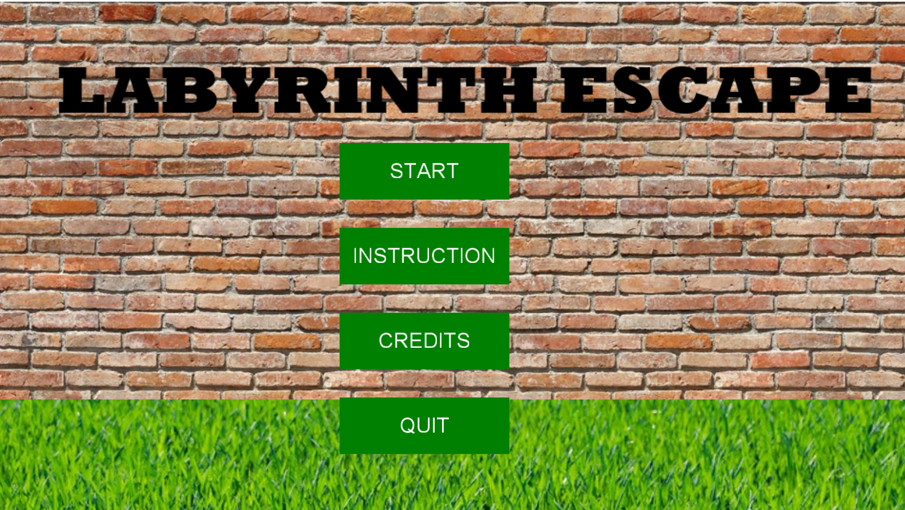
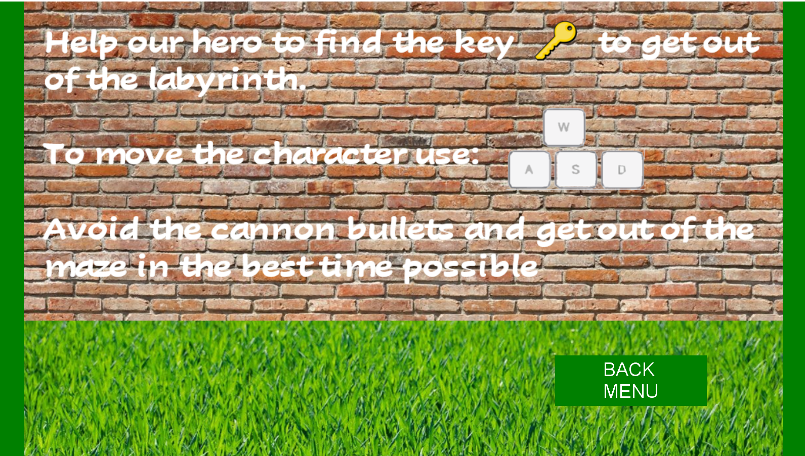

<b><h1>Labyrinth Escape</h1></b>

A video game by Jorge Leonardo Quimi Villon

*Computer graphics arch exam – games and simulation

<b><h2>Targets</h2></b>

Create a game, in this case rework the labyrinth covered during the lessons. 

<b><h2>Introduction</h2></b>

The development of the project was carried out using the Monogame framework and Visual Studio taking advantage of the knowledge learned during the COMPUTER GRAPHICS ARCH.- GAMES AND SIMULATION course and deepening the concepts necessary for the realization.

The name of the game is “labyrinth escape” and the main purpose is to find the exit path.

The player can move the character into the labyrinth where the key must be found to open the door at the end of the level. Along the way there will be obstacles that must be avoided, Otherwise the character will have to start the current level from the beginning and lose life. When the character has finished all the available lives there will be GAME OVER.

The game contains a timer which keeps the time taken to finish the levels in a single match. Finally, a comparison is made between the current time and the best time. In case, the current time is less than the best time, the current time takes the place of the best time.

The game is divided into several levels, in increasing order of difficulty.

<b><h2>MonoGame framework</b></h2>

Labyrinth Escape was create using MonoGame, an open Source framework for cross-platform videogames: it allows videogames porting to many platforms including Windows, Linux, iOS and Android. MonoGame allows the development of videogames by means of the C# object programming language by offering numerous classes that contain indispensable tools.

The structure of a game created with MonoGame is essentially based on three classes:

-   *Game*: the heart of the videogame which is also the entry point of the program. It contains the interfaces of the essential methods for the game and called by the base class:

    -   *Inizialize()*: contains the basic initialization of the graphics and input sector;
    -   *LoadConten()*: upload multimedia content 
    -   *Update()*: method called before rendering of each frame. It takes as input a GameTime object used to get a lot of information about the game's time status
    -   *Draw()*: renders all the elements of the game on the screen. As Update(), it takes a GameTime object as argument
-   *Graphics.SpriteBatch*: allows the rendering of all Texture2D objects 
-   *Content.ContentManage*r: allows to manage all the multimedia resources of the game. For this purpose, the framework provides the Content Pipeline tool which, by means of a graphic interface, allows an easier management of the contents.

<b><h2>The Structure of Labyrinth Escape</b></h2>

Below the most significant classes of the videogame:

<b><h2>The main classes</b></h2>

***game1***: derived from Game and so it is the entry-point class of the game. Contains game initialization, the state and level management. The Update() and Draw() methods of the MonoGame framework are implemented within it.

***Bullet***: sprite of bullets fired from cannons. This class contains information on the position of the bullet and the direction in which it is fired (through an enumerative data type). Furthermore, this class contains a private method which allows to calculate the field in which it can move. This method is called when the object of type bullet is instantiated and put into a list.

***Button***: This class allows the addition of button on the screen. It contains the following fields: position, size, color and the string positioned above the button. The two methods it implements are the following:
	-	*Click()*: manages the click on the button and changes color when the cursor passes over it.
	-	*Draw()*: to draw it on the screen.

***Label***: This class allows the addition of label on the screen. It contains the following fields: position, size, color and the string representing the label. The method it implements is the following: 
	-	*Draw()*: to draw it on the screen.
	
***Key***: This sprite represents the key. The class contains the location of the key inside the maze.

***Life***: This sprite represents the single life. At the beginning of each level a certain number of lives are instantiated (it can change from a minimum of 1 to a maximum of 5 lives per level) that the character can collect to increase his health. This class contains information on the location of each individual life.

***Collision***: This static class handles collisions with the character. In particular, this implements the following methods: 
	-	*CollisionBullet()*: When the character collides with a bullet, he loses a life and starts over from the beginning
	-	*CollisionKey()*: When the character encounters a key, it is deleted from the labyrinth and increasing the number of keys held
	-	*CollisionLife()*: When the character encounters a heart, it is deleted from the labyrinth and increasing the number of hearts held.

***Save***: This class manages a txt file in which the best time is saved in crossing the maze. when the game starts it is loaded and when a single game ends it updates if the time is less.

***Character***: This class allows to create a character capable of moving in the game and interacting with the obstacles on the map. Each Character object can be manipulated from the keyboard with WASD commands thanks to the method keyboardMgnt.

***Animation***: award to each individual sprite an animation given by the succession of frames which are grouped in a single texture. The animation technique is based on showing only a portion of the texture in which the frame you want to view is present.

<b><h2>The states of the game</b></h2>

To manage the different game states, an enumerative variable was used. The initial state is set inside the Game1 class in the LoadContent() method and in the Draw() and Update() methods of Game1 handle the different gameStatus.

- *MENU*: The main menu contains the buttons to reach the following states: Play, Instruction, Credits and close the game.

- *INSTRUCTION*: This screen explains the game mode and purpose. Adding a button to return to the main menu.

- *CREDITS*: Mention the sources that have been used (sound effect, sprite). Adding a button to return to the main menu.

<b><h2>Conclusion and future developments</b></h2>

The development of this game has been very important for the understanding and practice of creating 2D games using the C# language and Monogame.

A control system was used for the development of this game, Git version control system (VCS). In this case I did a single job, but it is very important if you do teamwork.

Labyrinth escape can still be improved and expanded. I thought it would be interesting to implement a recurse system of game state to recover an interrupted game. Also, in order to broaden the perspective of game, it may be useful to add new maps, and new traps. 